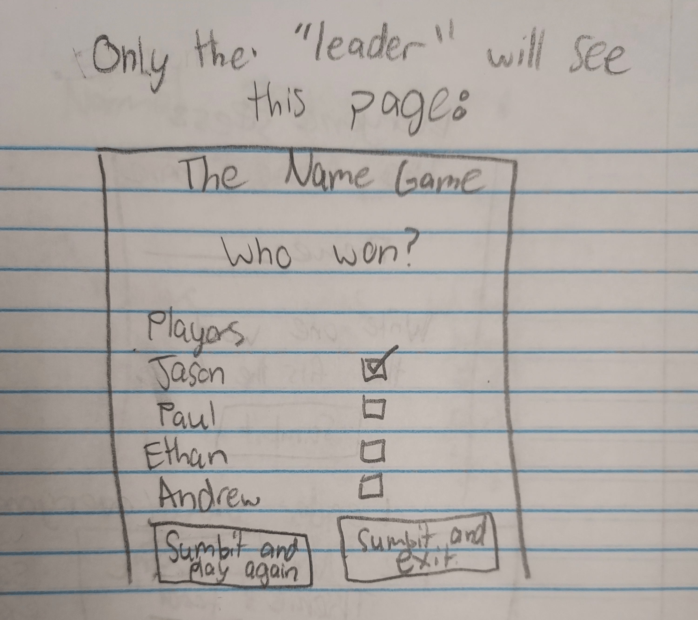

# Your startup name here
>  The Name Game

[My Notes](notes.md)

>  This application will allow users to play the "Name game" without the need of paper or someone to lead and not play the game. It will track how many times someone has won and the last themes that each person played with. 

>  In the game, everyone writes down a word from a certain theme (ex. actors, household items or just names in general). Then each player will have time to read the list of different words. The goal of the game is to remember each word and figure out who put down which word. Players take turns asking someone if they wrote down a certain word and goes until everyone but one were guessed. When you guess right then you form a team with that person and keep guessing until you guess incorrectly.

## 🚀 Specification Deliverable

> [!NOTE]
>  Fill in this sections as the submission artifact for this deliverable. You can refer to this [example](https://github.com/webprogramming260/startup-example/blob/main/README.md) for inspiration.

For this deliverable I did the following. I checked the box `[x]` and added a description for things I completed.

- [X] Proper use of Markdown
- [X] A concise and compelling elevator pitch
- [X] Description of key features
- [X] Description of how you will use each technology
- [X] One or more rough sketches of your application. Images must be embedded in this file using Markdown image references.

### Elevator pitch

>  Have you ever played the Name Game? It is a party game that is fun for groups of all sizes and ages. Everyone writes down a word from a
certain theme and gives it to the person in charge. This person will then read off the words. The goal of the game is to remember each word and figure out who put down which word! Normally there is someone who moniters the game and can't play but those days are long gone with this new application! Now everyone can play and there isn't even a need to get paper out! So get with your friends, hop on, and enjoy a evening full of laughter and fun!

### Design

### Key features

- Secure login over HTTPS
- Play the Name Game without paper or dedicated leader
- Ability to see how many wins each player has
- Ability to choose the theme each game
- Ability to input the winner
- Ability to see what theme each player played with last
- Ability for the whole group to look at all the names for however long the group decides
- Ability to see a random English Word each game

### Technologies

I am going to use the required technologies in the following ways.

- **HTML** - Uses correct HTML structure for applicaction. One for the login, one for the waiting for players page, one for inputing the word, one for the list of words, and one for the play again option and adding the winner.
- **CSS** - Adaptive application styling that will look simple and clean on all sizes.
- **React** - Accepts input for the theme, what words each person wants as their name, and who won the game. Also allows for logining in and changes screen based on point of the game.
- **Service** - Save/retrieve the game wins of each player and the last used theme for each player. Also it will use a third party to display a random English word.
- **DB/Login** - Stores users, user wins, the user's word, and the last theme that each user played with in database. No one can play the Name Game unless they first make an account.
- **WebSocket** - Takes all names inputed and displays a list of them to all players. Also as players join the game the player list will be updated.

## 🚀 AWS deliverable

For this deliverable I did the following. I checked the box `[x]` and added a description for things I completed.

- [X] **Server deployed and accessible with custom domain name** - [My server link](https://thenamegame.click/).

## 🚀 HTML deliverable

For this deliverable I did the following. I checked the box `[x]` and added a description for things I completed.

- [X] **HTML pages** - I added index.html for the table of contents essentially and also for a place to login and creat your acount. about.html is to learn about the game briefly. Play.html is for the waiting screen for players to come in and also choose the theme. Then they will preceed to the choose.html by clicking "Click when everyone is Ready" button. The choose.html will be the place where everyone secretly puts in their word and then click submit. 
- [X] **Proper HTML element usage** - I correctly used HTML element usage like main, head, etc.
- [X] **Links** - I added links to go between the different html pages. Also by clicking the previously mentioned button it goes to the other html file.
- [X] **Text** - There is text to explain the functions of buttons and everything.
- [X] **3rd party API placeholder** - In the play.html there is a place that says, "Random Word: Tail" which is a placeholder for the random word that people will see while they wait.
- [X] **Images** - I added a magnifying glass image to the play.html and also a disguised man image to the about.html. There is the same image for the icon on the top of the web browser.
- [X] **Login placeholder** - On the index.html there is a place to login or create your account.
- [X] **DB data placeholder** - There is a table in the play.html that displays different info of the players like name, wins, and last theme that they played with. 
- [X] **WebSocket placeholder** - There are buttons to sumbit the choosen word for the theme that will then be displayed in the section "List of Words" which will be able to toggled on and off with the button "View List of Names".

## 🚀 CSS deliverable

For this deliverable I did the following. I checked the box `[x]` and added a description for things I completed.

- [X] **Header, footer, and main content body** - I made these different sections responsive and have color.
- [X] **Navigation elements** - There is the responsive navigation that is very orange and allows users to go between pages through the links. It also changes size of font when you hover over each word.
- [X] **Responsive to window resizing** - I did this.
- [X] **Application elements** - Yes, there are buttons and by clicking "click when everyone is ready" you will go to the choose.html file. There are text boxes to fillout to login and also a table for the players and also a list for the different names that everyone chooses.
- [X] **Application text content** - There is a body of text in the about.html file that is orange and also in a box. There are different words bolded and different sizes throughout the entire thing.
- [X] **Application images** - There are two images, one in the play.html and one in the about.html.

## 🚀 React part 1: Routing deliverable

For this deliverable I did the following. I checked the box `[x]` and added a description for things I completed.

- [X] **Bundled using Vite** - Yes I did this!
- [X] **Components** - I made react components so you can be routed between the different pages.
- [X] **Router** - Yes I implemented the router.

## 🚀 React part 2: Reactivity

For this deliverable I did the following. I checked the box `[x]` and added a description for things I completed.

- [X] **All functionality implemented or mocked out** - Everything works! You can create an account and password and it makes sure that username isn't already taken and that you log in with a real username and password. Locally stores the username and passwords, last theme, and also the different names that were added in the choose.jsx part. It also doesn't allow you to click play unless you have made an account. There is a placeholder that uses setInterval to display the random word. It also uses setInterval to mimick more players joining the play.jsx screen and people adding names in the choose.jsx part. You can show or hide the names and also clear the added names to make it replayable. Also you can add the choosen theme which gets locally stored as the last theme played and displays that theme in the choose.jsx.
- [X] **Hooks** - Used useState and useEffect in multiple places.

## 🚀 Service deliverable

For this deliverable I did the following. I checked the box `[x]` and added a description for things I completed.

- [X] **Node.js/Express HTTP service** - Yes I did this!
- [X] **Static middleware for frontend** - Yes I did this as well!
- [X] **Calls to third party endpoints** - I call a 3rd party endpoint for a random word in my play.jsx file.
- [X] **Backend service endpoints** - I have this! I have a placeholder for login that stores the current user on the server. I also have endpoints for the theme, the added names, the login, and the logout.
- [X] **Frontend calls service endpoints** - I did this! The frontend calls the theme to update the last theme of the user and also updates and gets the list of the names in the choose.jsx.
- [X] **Supports registration, login, logout, and restricted endpoint** - Yes it allows for registration, and authenticates the user, you can logout, and the logout button appears and disappears when you are logged in or not, checks the cookie to do other requests. 

## 🚀 DB/Login deliverable

For this deliverable I did the following. I checked the box `[x]` and added a description for things I completed.

- [ ] **User registration** - I did not complete this part of the deliverable.
- [ ] **User login and logout** - I did not complete this part of the deliverable.
- [ ] **Stores data in MongoDB** - I did not complete this part of the deliverable.
- [ ] **Stores credentials in MongoDB** - I did not complete this part of the deliverable.
- [ ] **Restricts functionality based on authentication** - I did not complete this part of the deliverable.

## 🚀 WebSocket deliverable

For this deliverable I did the following. I checked the box `[x]` and added a description for things I completed.

- [ ] **Backend listens for WebSocket connection** - I did not complete this part of the deliverable.
- [ ] **Frontend makes WebSocket connection** - I did not complete this part of the deliverable.
- [ ] **Data sent over WebSocket connection** - I did not complete this part of the deliverable.
- [ ] **WebSocket data displayed** - I did not complete this part of the deliverable.
- [ ] **Application is fully functional** - I did not complete this part of the deliverable.
